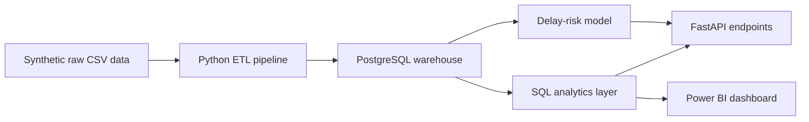
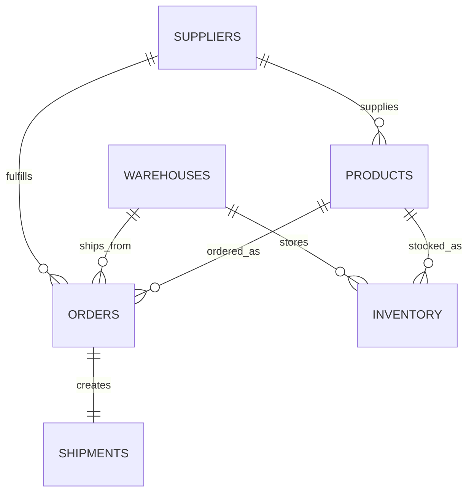

# Supply Chain Delay Intelligence Platform

A portfolio project for analyzing, monitoring, and predicting supply chain delays using Python, PostgreSQL, SQL, FastAPI, Docker, and Power BI.

## Business Problem

Operations teams often know that shipments are late, but they do not always know why. Delays can come from unreliable suppliers, overloaded warehouses, stock availability problems, transport issues, or weak planning data.

This project turns raw operational data into a dashboard-ready analytics layer that helps business users answer practical questions:

- Which suppliers are most reliable?
- Which warehouses are creating bottlenecks?
- Which products or inventory locations have stockout risk?
- What are the most common delay reasons?
- Are there patterns that can help flag shipment delay risk earlier?

## Target Users

- Operations manager
- Logistics analyst
- Warehouse manager
- Business analyst
- Supply chain analyst

## Why This Project Matters

This project is designed to demonstrate skills relevant for Data Analyst, BI Analyst, and Junior Data Engineer Werkstudent roles in Germany:

- **SQL and data modeling:** normalized source tables plus analytics-ready KPI views.
- **Data cleaning:** realistic missing values, date handling, and operational edge cases.
- **ETL development:** repeatable pipeline from raw CSV files into PostgreSQL.
- **BI readiness:** Power BI-friendly tables and KPI definitions.
- **API development:** FastAPI endpoints for operational metrics and prediction results.
- **Basic predictive analytics:** an interpretable delay-risk model with clear limitations.
- **Professional delivery:** Docker setup, tests, CI, documentation, and realistic commit history.

## Planned Architecture



## Synthetic Dataset

Phase 2 generates realistic synthetic CSV data for the supply chain domain. The default configuration creates:

- 24 suppliers with high, medium, and low reliability bands.
- 8 German warehouse locations with different capacity risk profiles.
- 180 products across electronics, packaging, mechanical, textiles, and raw materials.
- 1,440 inventory snapshot rows across products and warehouses.
- 12,000 orders.
- 12,000 shipments.

The generated data intentionally includes operational issues that are useful for analytics practice:

- Delayed deliveries.
- Missing promised delivery dates in raw shipment data.
- In-transit shipments without actual delivery dates.
- Supplier reliability variation.
- Warehouse overload flags.
- Stockout risk when order quantity is higher than available inventory.
- Seasonal shipment pressure during Q4 and month-end periods.

Raw files are written to `data/raw/`. Cleaned and analysis-ready files are written to `data/processed/`. Small preview files are written to `data/sample/`.

## ETL Pipeline

Phase 4 adds a modular CSV ETL pipeline that validates raw files, cleans operational data quality issues, and prepares analytics-ready outputs for PostgreSQL and BI work.

Run the ETL:

```powershell
python -m src.etl.run_etl --raw-dir data/raw --processed-dir data/processed
```

The ETL creates:

- `dim_suppliers.csv`
- `dim_warehouses.csv`
- `dim_products.csv`
- `fact_inventory.csv`
- `fact_orders.csv`
- `fact_shipments.csv`
- `mart_shipment_analytics.csv`
- `etl_summary.json`

Important cleaning logic:

- Validates required columns, keys, and relationships.
- Standardizes date, boolean, numeric, and categorical fields.
- Recalculates `delay_days` from promised and actual delivery dates.
- Corrects inconsistent `is_delayed` labels.
- Builds a shipment analytics mart with supplier, warehouse, product, order, and delay context.

## Entity Relationships



## Data Generation Workflow

Run the synthetic data generator:

```powershell
python -m src.data_generation.generate_data --config src/config/data_generation.json
```

The workflow is:

```text
src/config/data_generation.json
  -> src/data_generation/generate_data.py
  -> data/raw/*.csv
  -> data/processed/*.csv
  -> data/sample/*_sample.csv
```

The default generation uses random seed `42`, making the dataset reproducible for testing, documentation, and dashboard screenshots.

## Planned KPI Examples

- On-time delivery rate
- Average delay days
- Supplier reliability score
- Warehouse delay rate
- Inventory stockout risk
- Delayed order percentage
- Top delay reasons
- Monthly delay trend

## Repository Structure

```text
.
|-- api/                  # FastAPI application, routes, and services
|-- dashboards/           # Power BI dashboard plan and screenshots placeholder
|-- data/
|   |-- raw/              # Generated or source CSV files
|   |-- processed/        # Cleaned outputs for validation and debugging
|   `-- sample/           # Small sample files for documentation
|-- docs/                 # Architecture, schema, API, and business documentation
|-- notebooks/            # Optional exploration notebooks
|-- sql/                  # Schema, seed data, and analytics queries
|-- src/
|   |-- config/           # Configuration helpers
|   |-- data_generation/  # Synthetic data generation scripts
|   |-- database/         # Database connection and loading utilities
|   |-- etl/              # Extraction, cleaning, and transformation logic
|   |-- features/         # KPI and model feature engineering
|   |-- models/           # Delay-risk model training and inference code
|   `-- utils/            # Shared helper functions
|-- tests/                # Unit and integration tests
|-- docker-compose.yml    # Local PostgreSQL service
|-- requirements.txt      # Python dependencies
`-- .github/workflows/    # CI workflow
```

## Phase Roadmap

1. **Project setup:** structure, README, requirements, Git ignore rules, Docker scaffold, and CI.
2. **Synthetic data generation:** realistic supply chain entities and raw CSV files.
3. **PostgreSQL schema:** source tables, keys, relationships, and seed strategy.
4. **ETL pipeline:** clean raw data and load analytics-ready tables.
5. **SQL analytics:** KPI queries and business analysis views.
6. **FastAPI backend:** endpoints for KPIs, supplier performance, bottlenecks, delay analysis, inventory risk, and prediction.
7. **Delay-risk model:** interpretable baseline model with honest limitations.
8. **Testing and hardening:** pytest coverage, logging, error handling, and Docker improvements.
9. **Power BI plan:** dashboard pages, chart choices, and screenshot placeholders.
10. **Final documentation polish:** recruiter-ready README, architecture notes, and business insights.

## Local Setup

Create and activate a virtual environment:

```powershell
python -m venv .venv
.\.venv\Scripts\Activate.ps1
```

Install dependencies:

```powershell
python -m pip install --upgrade pip
pip install -r requirements.txt
```

Create a local environment file:

```powershell
Copy-Item .env.example .env
```

Generate synthetic data:

```powershell
python -m src.data_generation.generate_data --config src/config/data_generation.json
```

Run the ETL pipeline:

```powershell
python -m src.etl.run_etl --raw-dir data/raw --processed-dir data/processed
```

Start PostgreSQL:

```powershell
docker compose up -d postgres
```

Run tests:

```powershell
pytest
```

Run lint checks:

```powershell
ruff check .
```

## Current Status

Phase 4 is complete. The repository now includes a configurable synthetic data generator, PostgreSQL schema files, a modular CSV ETL pipeline, analytics-ready processed outputs, validation checks, tests, and documentation.

SQL analytics, API routes, prediction model, and dashboard artifacts will be added in later phases.
