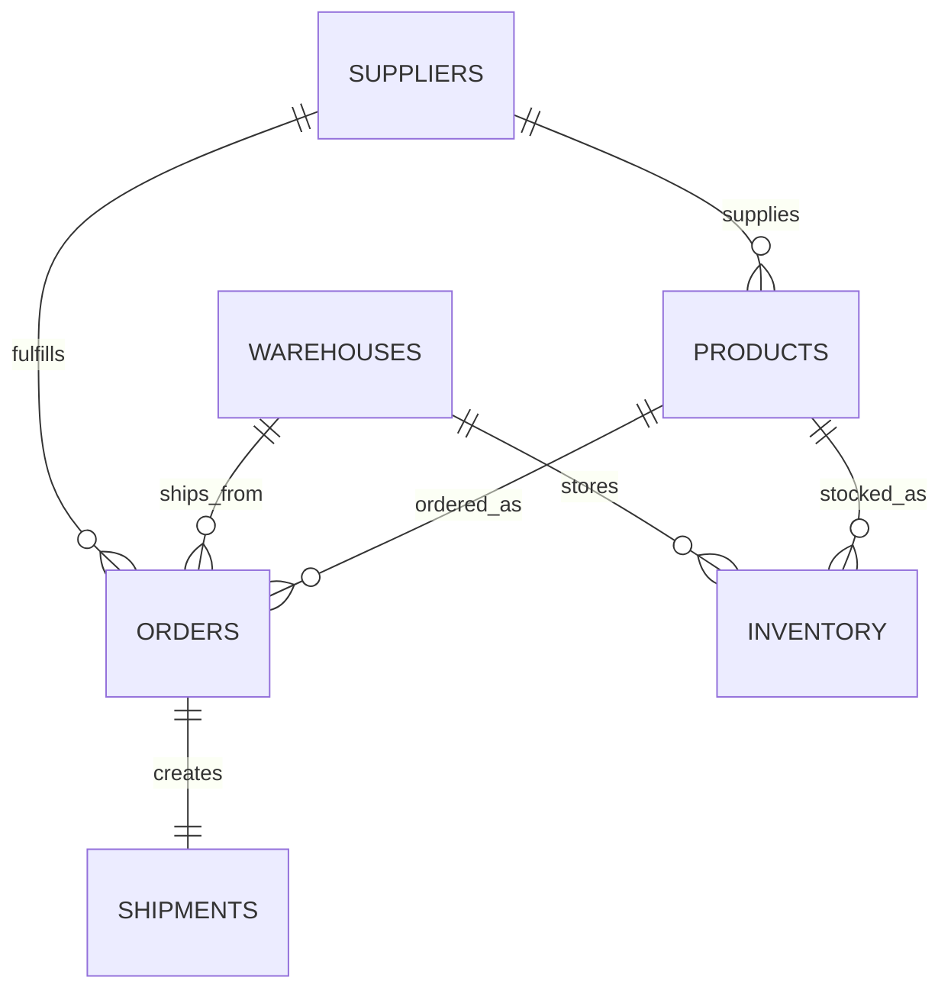

# Phase 2: Synthetic Data Generation

## What We Built

Phase 2 adds a reproducible synthetic data generator for realistic supply chain operations. It creates raw CSV files and cleaned analysis-ready CSV files without introducing the PostgreSQL schema or ETL database loading yet.

Generated raw datasets:

- `suppliers.csv`
- `warehouses.csv`
- `products.csv`
- `inventory.csv`
- `orders.csv`
- `shipments.csv`

Generated processed datasets:

- `orders_clean.csv`
- `shipments_clean.csv`
- `shipment_analytics.csv`
- `generation_summary.json`

## Business Scenarios Simulated

- Supplier reliability variation, including high, medium, and low reliability bands.
- Warehouse overload risk that increases during Q4 seasonal peaks.
- Inventory shortage risk when order quantities exceed available stock.
- Missing promised delivery dates in the raw shipment data.
- In-transit shipments with missing actual delivery dates.
- Delays caused by supplier dispatch issues, warehouse capacity, carriers, inventory shortages, customs, weather, and quality holds.

## Why This Matters for Data and BI Roles

This phase shows that the project can produce realistic source data for later SQL, ETL, dashboarding, and API work. It demonstrates:

- Understanding of operational data relationships.
- Reproducible data generation using a fixed random seed.
- Configurable dataset size.
- Data quality issues that later cleaning logic can handle.
- Validation checks before data is trusted for analytics.

## Entity Relationships



## Data Generation Workflow

```text
JSON config
    -> supplier, warehouse, product, and inventory generation
    -> order and shipment generation
    -> relationship and operational validation
    -> raw CSV files in data/raw
    -> cleaned CSV files in data/processed
    -> small preview CSV files in data/sample
```

## Terminal Commands

Run the default generator:

```powershell
python -m src.data_generation.generate_data --config src/config/data_generation.json
```

Change dataset size by editing:

```text
src/config/data_generation.json
```

Then run the generator again.

## Expected Output Example

```text
INFO Generating synthetic datasets with seed=42
INFO Wrote 12000 raw rows for orders
INFO Wrote 12000 raw rows for shipments
INFO Wrote 12000 processed rows for shipment_analytics
INFO Generation complete: {'shipment_rows': 12000, 'delivered_rows': 11243, 'delay_rate': 0.4036}
```

## Suggested Phase 2 Commits

```text
feat: add configurable synthetic data generation settings
feat: generate supplier warehouse product and inventory data
feat: generate realistic order and shipment datasets
feat: add processed shipment analytics output
test: validate generated data relationships and delay rates
docs: document synthetic dataset workflow
```

## Branch Name Suggestion

```text
feature/phase-2-synthetic-data-generation
```

